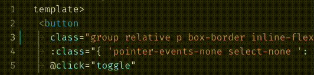

# px to rem

This is an extension for Visual Studio Code that allows you to convert px to tailwind unit

## Usage

### Keybindings

- `Alt+Z` Px to Tailwind unit (default divded 4).
- `Alt+S` Asks for a new px per rem value.

### Commands

- Px to Tailwind unit (default divded 4).
- Px to rem, and rem to px. Converts selected text from px to rem, and rem to px.
- Px to rem. Converts selected text from px to rem
- Rem to px. Converts selected text from rem to px
- Px per rem. Asks for a new px per rem value.

## Extension Settings

This extension contributes the following settings:

- `px-to-rem.px-per-rem`: number of pixels per rem. Default is `14` pixels per rem.
- `px-to-rem.number-of-decimals-digits`: maximum number of decimals digits a px or rem can have
- `px-to-rem.only-change-first-ocurrence`: set to change all or only the first selected ocurrence of px/rem
- `px-to-rem.notify-if-no-changes`: enable/disable notification that alerts the users if no conversion could be made

## Known Issues

- If you select a value with multiple cursors it will get converted, but following cursors may change place after the conversion.
- '_Edits from command extension.pxToremAndRemToPx were not applied_' message appears in debug console.
